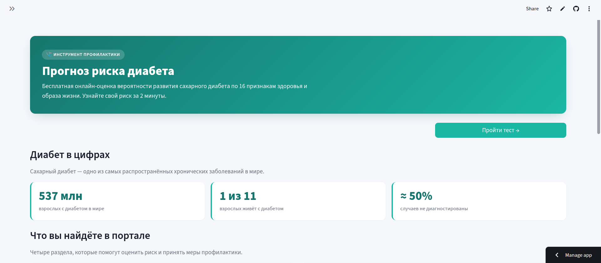
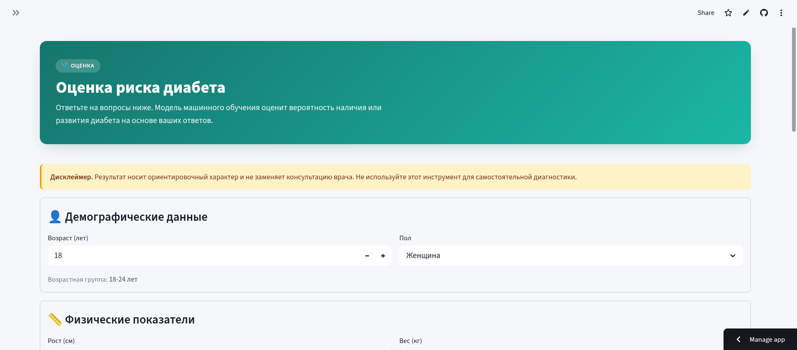
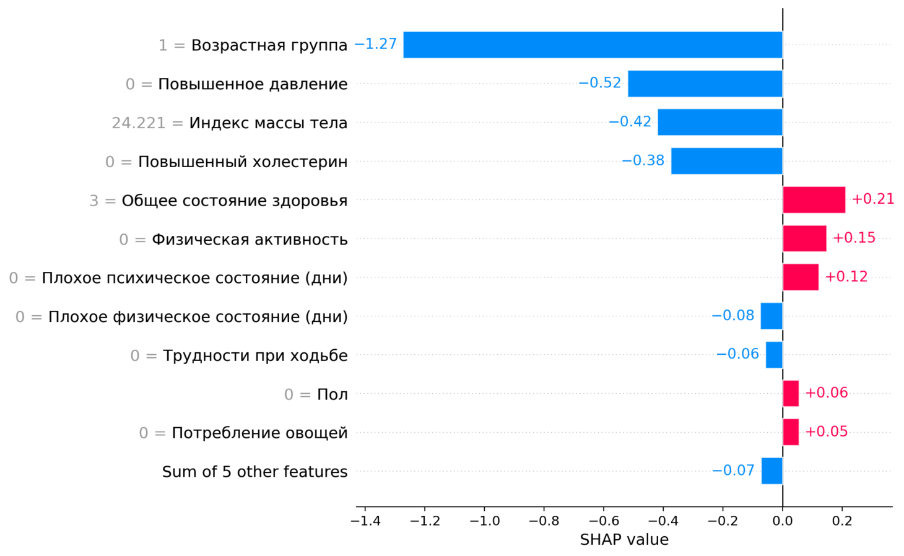
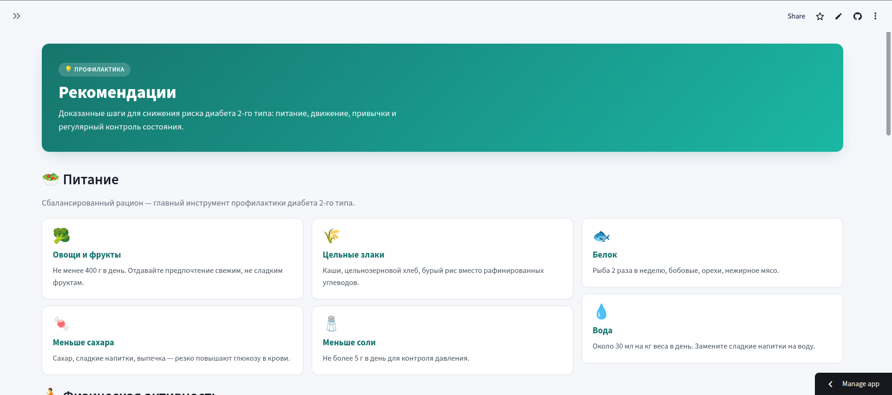
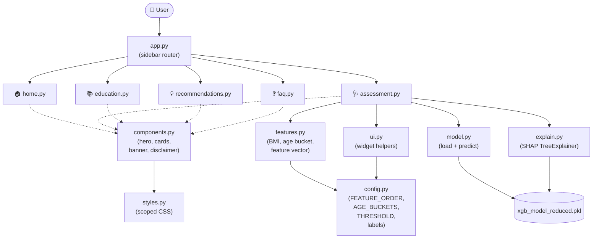

# 🩺 Diabetes Risk Prediction Portal

A multi-page Streamlit web app that estimates an individual's risk of diabetes
from 16 health-and-lifestyle answers, explains the prediction with SHAP, and
provides educational content, recommendations, and an FAQ.


> ⚠️ **Medical disclaimer.** This portal provides an indicative risk score for
> educational purposes only. It is **not** a diagnostic tool and does not
> replace consultation with a qualified physician.

---

## 📑 Table of Contents

- [Features](#-features)
- [Screenshots](#-screenshots)
- [Architecture](#-architecture)
- [Project Structure](#-project-structure)
- [Tech Stack](#-tech-stack)
- [Installation](#-installation)
- [Docker](#-docker)
- [How the Model Works](#-how-the-model-works)
- [Development Notes](#-development-notes)
- [License](#-license)

---

## ✨ Features

- 🩺 **ML-powered risk assessment** — XGBoost classifier trained on 16
  health-and-lifestyle features (BMI, blood pressure, cholesterol,
  physical activity, mental/physical wellbeing days, etc.).
- 🔍 **SHAP explanations** — every prediction includes a top-3
  positive/negative factor breakdown, a waterfall plot, and a bar chart of
  feature contributions.
- 🏠 **Multi-page portal** — home, risk assessment, education, recommendations,
  and FAQ, navigated through a sidebar.
- 📚 **Educational content** (in Russian) — types of diabetes, symptoms, risk
  factors, complications, and prevalence statistics.
- 💡 **Recommendations** — diet, physical activity, lifestyle, and monitoring
  guidance, with explicit "when to see a doctor" guidance.
- ❓ **12-item FAQ** — common questions about diabetes and how the model works.
- 🎨 **Modern, theme-safe UI** — gradient hero banners, info cards, stat cards,
  result banners, all rendered with component-scoped CSS so they stay legible
  in any Streamlit theme.
- 🧩 **Modular architecture** — pure feature engineering, model I/O, and SHAP
  explanations are kept Streamlit-free and reusable from a CLI, FastAPI, or
  tests.

---

## 📸 Screenshots

> Add PNGs to `docs/screenshots/` to populate the table below.

| Home | Risk Assessment |
|:---:|:---:|
|  |  |
| **SHAP Explanation** | **Recommendations** |
|  |  |

---

## 🏗️ Architecture



**Layer responsibilities**

| Layer | Files | Streamlit-free? |
|---|---|:---:|
| Routing | `app.py` | ❌ |
| Pages (composition) | `src/pages/*.py` | ❌ |
| UI primitives | `src/ui.py`, `src/components.py`, `src/styles.py` | ❌ |
| Domain logic | `src/features.py`, `src/model.py`, `src/explain.py` | ✅ |
| Constants | `src/config.py` | ✅ |

Pure layers (Streamlit-free) can be reused from a CLI, a FastAPI endpoint, or
pytest tests without dragging in the UI.

---

## 📁 Project Structure

```
diabetes-risk-prediction/
├── app.py                       # Streamlit entrypoint — sidebar router
├── src/
│   ├── __init__.py
│   ├── config.py                # FEATURE_ORDER, AGE_BUCKETS, THRESHOLD, Russian labels
│   ├── features.py              # Pure: BMI, age bucket, yes/no encoders, feature vector
│   ├── model.py                 # joblib loader + predict_probability + predict_risk
│   ├── explain.py               # SHAP TreeExplainer + top_factors
│   ├── ui.py                    # Reusable input widgets (yes_no_input, sex_input, ...)
│   ├── components.py            # Display: hero, info_card, stat_card, banner, disclaimer
│   ├── styles.py                # Scoped CSS (component classes only)
│   └── pages/
│       ├── __init__.py
│       ├── home.py              # Landing hero + stats + feature grid + CTAs
│       ├── assessment.py        # 16-question form + result banner + SHAP plots
│       ├── education.py         # Types, symptoms, risk factors, complications
│       ├── recommendations.py   # Diet, activity, lifestyle, monitoring
│       └── faq.py               # 12 expandable Q&A
├── xgb_model_reduced.pkl        # Trained XGBoost classifier (~540 KB)
├── requirements.txt
├── runtime.txt                  # python-3.11
├── Dockerfile
├── .dockerignore
└── README.md
```

---

## 🛠️ Tech Stack

| Component | Purpose |
|---|---|
| **Python 3.11** | Runtime |
| **Streamlit** | Web UI & routing |
| **XGBoost** | Gradient-boosted tree classifier |
| **SHAP** | Per-prediction explainability (TreeExplainer) |
| **scikit-learn** | Pickle-side dependencies for the classifier |
| **joblib** | Model serialization |
| **NumPy** | Feature vector assembly |
| **Matplotlib** | Rendering SHAP plots |

---

## 🚀 Installation

### Prerequisites

- Python **3.11+**
- `pip` (or `uv` / `poetry`)
- ~500 MB of free disk space for dependencies

### Quick start

```bash
# 1. Clone
git clone https://github.com/<your-username>/diabetes-risk-prediction.git
cd diabetes-risk-prediction

# 2. Create a virtual environment (recommended)
python -m venv .venv
source .venv/bin/activate          # macOS / Linux
# .venv\Scripts\activate            # Windows PowerShell

# 3. Install dependencies
pip install -r requirements.txt

# 4. Run the app
streamlit run app.py
```

The portal will open in your browser at <http://localhost:8501>.

---

## 🐳 Docker

A `Dockerfile` and `.dockerignore` are provided. The image is based on
`python:3.11-slim` and exposes Streamlit on port `8501`.

### Build

```bash
docker build -t diabetes-portal .
```

### Run

```bash
docker run --rm -p 8501:8501 diabetes-portal
```

Then open <http://localhost:8501>.

### Run detached, with a friendly name

```bash
docker run -d --name diabetes-portal -p 8501:8501 --restart unless-stopped diabetes-portal
docker logs -f diabetes-portal      # tail logs
docker stop diabetes-portal         # stop
```

### Healthcheck

The container exposes Streamlit's `/_stcore/health` endpoint via Docker's
`HEALTHCHECK` directive — `docker ps` will show `(healthy)` once the app is
ready.

---

## 🧠 How the Model Works

- **Model:** XGBoost binary classifier, serialized with `joblib`
  (`xgb_model_reduced.pkl`).
- **Features (16):** `HighBP`, `HighChol`, `BMI`, `Smoker`, `Stroke`,
  `HeartDiseaseorAttack`, `PhysActivity`, `Fruits`, `Veggies`,
  `HvyAlcoholConsump`, `GenHlth`, `MentHlth`, `PhysHlth`, `DiffWalk`, `Sex`,
  `Age` (binned into 13 buckets).
- **Decision threshold:** `0.37` (tuned for recall in `src/config.py`).
- **Explanations:** `shap.TreeExplainer` runs against the loaded booster; the
  resulting SHAP values are rendered as a waterfall plot and a bar plot, with
  feature names translated to Russian.

> The `xgb_model_reduced.pkl` artifact is shipped pre-trained. Retraining is
> out of scope of this repo.

---

## 🧑‍💻 Development Notes

- **Adding a page** — drop a new module under `src/pages/` that exposes
  `render(model) -> None`, then register it in the `PAGES` dict in `app.py`.
- **CSS rules** — only target classes defined in `src/styles.py`
  (`.hero`, `.info-card`, `.stat-card`, `.disclaimer`, `.result-banner`,
  `.section-lead`). Do **not** target Streamlit internals (`[data-testid=...]`,
  `[role=...]`, `.stApp`, `.stButton`, `.stSidebar`, `#MainMenu`) — those
  selectors break across Streamlit versions and conflict with light/dark themes.
- **Optional explainability** — `shap` and `matplotlib` are lazy-imported in
  `assessment.py`. The app still starts and the prediction still works if
  those packages are missing; only the explanation section is gated behind a
  friendly "please install" message.
- **Model contract** — feature names and order live in
  `src.config.FEATURE_ORDER`. Changing the order requires retraining the model.

---

## 📄 License

MIT License

Copyright (c) [2026] [Kim Vyacheslav]

Permission is hereby granted, free of charge, to any person obtaining a copy
of this software and associated documentation files (the "Software"), to deal
in the Software without restriction, including without limitation the rights
to use, copy, modify, merge, publish, distribute, sublicense, and/or sell
copies of the Software, and to permit persons to whom the Software is
furnished to do so, subject to the following conditions:

The above copyright notice and this permission notice shall be included in all
copies or substantial portions of the Software.

THE SOFTWARE IS PROVIDED "AS IS", WITHOUT WARRANTY OF ANY KIND, EXPRESS OR
IMPLIED, INCLUDING BUT NOT LIMITED TO THE WARRANTIES OF MERCHANTABILITY,
FITNESS FOR A PARTICULAR PURPOSE AND NONINFRINGEMENT. IN NO EVENT SHALL THE
AUTHORS OR COPYRIGHT HOLDERS BE LIABLE FOR ANY CLAIM, DAMAGES OR OTHER
LIABILITY, WHETHER IN AN ACTION OF CONTRACT, TORT OR OTHERWISE, ARISING FROM,
OUT OF OR IN CONNECTION WITH THE SOFTWARE OR THE USE OR OTHER DEALINGS IN THE
SOFTWARE.
